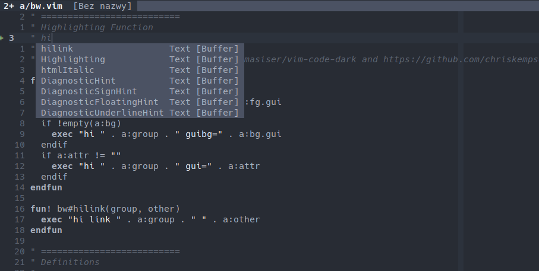

# BW

Monochrome vim colorscheme, inspired by [onedark](https://github.com/joshdick/onedark.vim).

Usage: `:colorscheme bw-onedark`.

## Features:

- lightline support
- neovim support
- terminal support for both vim and neovim
- lazy.nvim support
- treesitter support
- support for many different filetypes
